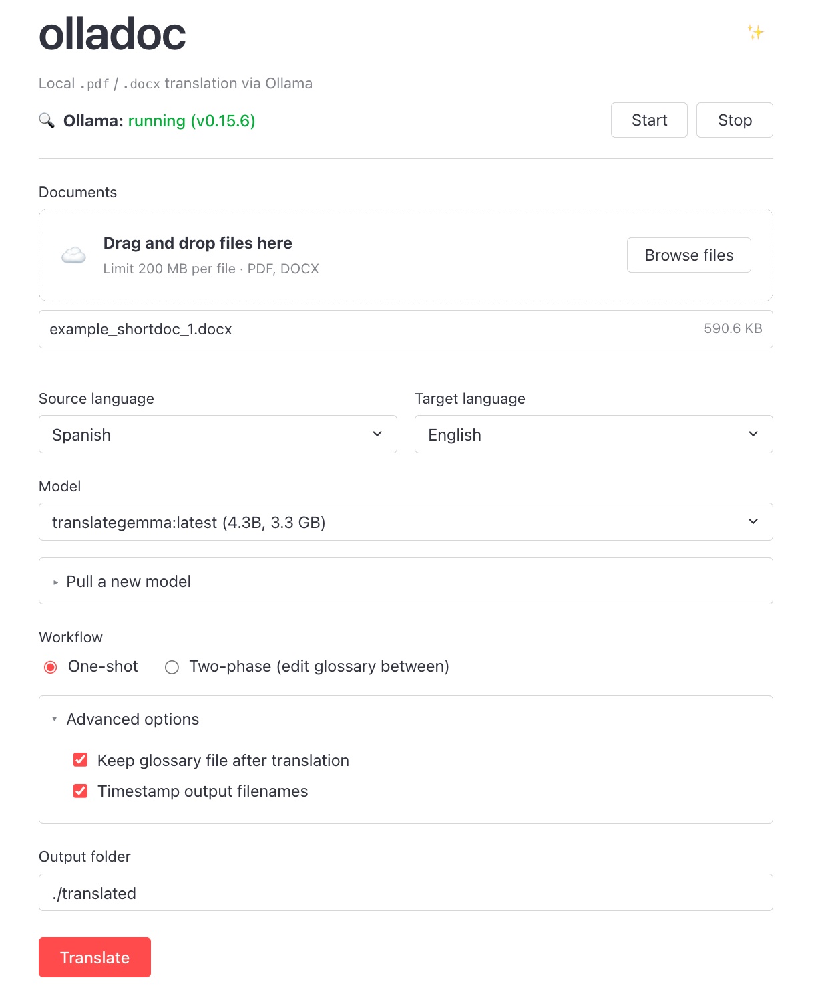

# olladoc

**Document translation that runs entirely on your own machine.**

olladoc translates `.pdf` and `.docx` files using a language model served by [Ollama](https://ollama.com). Nothing is uploaded — no cloud APIs, no accounts, no per-page costs — which makes it safe for sensitive material.

Beyond privacy, two other things set it apart from pasting text into an online translator:

- **Terminology stays consistent.** olladoc first reads the whole document and builds a glossary of its names, institutions, and technical terms — which to translate (and how), which to keep verbatim. You can review and edit the glossary before it's applied, and every translated chunk is checked against it.
- **Structure survives.** Headings, lists, footnotes, comments, and tables are extracted, translated, and reassembled into a proper `.docx`.

Use it from a point-and-click [web UI](#using-the-web-app) or the [command line](#using-the-cli). Developed at the Global Rights Innovation Lab, UC Berkeley.

## Contents

- [Setup](#setup)
- [Run](#run)
- [Using the web app](#using-the-web-app)
- [Using the CLI](#using-the-cli)
- [Using the notebook](#using-the-notebook)
- [Output](#output)
- [How it works](#how-it-works)
- [Modules](#modules)
- [License](#license)

## Setup

**1. Install Ollama**

- macOS: `brew install ollama`
- Other: download from https://ollama.com/download

**2. Pull a translation model**

```
ollama pull translategemma
```

The model is several GB so the first pull can take a while. Pulling needs Ollama running (see [Run](#run) for the ways to start it) — or skip this step and use the web UI's "Pull a new model" button later. Default model is Google's [TranslateGemma](https://blog.google/innovation-and-ai/technology/developers-tools/translategemma/) but any Ollama-compatible model can work.

**3. Create a Python environment (Python 3.10+)**

```
# venv
python3 -m venv .venv
source .venv/bin/activate
```

```
# conda
conda create -n olladoc python=3.12   # any version >= 3.10 works
conda activate olladoc
```

**4. Install dependencies**

```
pip3 install -r requirements.txt
```

## Run

[Setup](#setup) is one-time; after that, every session takes the same three steps.

**1. Activate your environment**

```
source .venv/bin/activate       # or: conda activate olladoc
```

**2. Make sure Ollama is running** — any one of these works:

- **Desktop app** — if you installed the Ollama desktop app, it's probably already running (it auto-starts at login; look for the menubar icon).
- **olladoc itself** — the web UI's status bar has a Start button.
- **Terminal** — run `ollama serve`. It keeps running in the foreground and occupies that terminal; leave it open and continue in a second window.

**3. Use the app** — pick one:

**Option A — web UI**

```
python3 app_flask.py
```

The terminal will print `WARNING: This is a development server` — that's expected, since the app is meant to run locally. Open http://localhost:5001. See [Using the web app](#using-the-web-app) for a tour of the interface.

**Option B — CLI**

```
python3 translate.py INPUT OUTPUT.docx
```

See [Using the CLI](#using-the-cli) for flags, batch mode, and two-phase workflow.

## Using the web app



**Ollama status bar (top).** Shows whether `http://localhost:11434` is reachable. Start / Stop control an Ollama process olladoc manages itself; Stop is only enabled for processes it launched. "View logs" tails either olladoc's log or `~/.ollama/logs/server.log`. "Pull a new model" downloads from [ollama.com/library](https://ollama.com/library) with a live log and cancel button.

**Upload and settings.** Drag-and-drop or browse (200 MB per file). Source and target language pickers (default Spanish to English). Model dropdown lists installed Ollama models.

**Workflow modes.**
- One-shot: Phase 1 (glossary building) straight into Phase 2 (translation) without stopping.
- Two-phase: Stop after Phase 1, edit the glossary in the browser, then continue to Phase 2.

**Advanced options.** Keep-glossary toggle (on by default) and timestamp-outputs toggle (adds `_YYYY-MM-DD_HHMM` to filenames).

**Output folder.** Where translated `.docx` files land. Defaults to `./translated`.

**Progress.** After clicking Translate, the UI polls `/api/status/<job_id>` every second and streams a log tail: extraction counts, chunk translations, glossary violations, sanity-check warnings.

**Glossary review (two-phase only).** Phase 1 output renders as one editable textarea per document. The format is documented in the file header:

```
TRANSLATE: source → target       (enforced; triggers retry on violation)
KEEP: term                       (kept verbatim, never translated)
PREFER: source → target          (soft hint included in the prompt)
```

Multiple source variants of the same entity go on one line separated by `|`, e.g.:

```
TRANSLATE: Comisión Interamericana | CIDH | la Comisión → Inter-American Commission
```

<!-- SCREENSHOT: glossary review panel. -->

**Results.** Per-file success/failure banner, character and block counts, and a download link per output file.

## Using the CLI

`translate.py` takes exactly one input file (`.pdf` or `.docx`); output is always `.docx`. To translate a whole folder, use [`batch_translate.py`](#batch-a-folder) instead.

```
python3 translate.py INPUT OUTPUT.docx [--source-lang X] [--target-lang Y] [--model M]
```

For example, to translate an English document into Spanish:

```
python3 translate.py doc1_English.docx doc1_Spanish.docx --source-lang English --target-lang Spanish
```

Note that one run can produce **several files**, not just OUTPUT.docx: the glossary (e.g. `doc1_Spanish_glossary.txt`) plus separate docx files for tables, footnotes, and comments if the source has them (see [Output](#output)). They are all written next to OUTPUT.docx.

**Two-phase workflow** — build the glossary, edit it manually, then translate with it:

```
python3 translate.py informe.docx informe_en.docx --glossary-only
# → writes informe_en_glossary.txt and stops; open it in any text editor
python3 translate.py informe.docx informe_en.docx --translate-only
# → same paths again; picks up your edited informe_en_glossary.txt
```

Flags for two-phase workflow:

- `--glossary-only`: run Phase 1 only, then stop (lets you edit the glossary)
- `--translate-only`: skip Phase 1, reuse an existing glossary file
- `--force-rebuild`: delete any existing glossary file before Phase 1
- `--no-glossary`: skip the glossary entirely (raw translation)
- `--seed N`: Ollama generation seed (default 42)
- `--archive-glossary PATH`: copy the glossary to PATH after Phase 2 (e.g. `archive/glossary_2026-06-21.txt`)
- `--timestamp`: insert the current timestamp into output filenames so each run produces distinct (docx, glossary) pairs
- `--phases build_glossary translate`: explicit form

Every run appends one JSON line to `<output_dir>/translation_log.jsonl` recording timestamp, input, output, glossary, phases, and model.

**Batch a folder:**

```
python3 batch_translate.py INPUT_DIR OUTPUT_DIR [--source-lang X] [--target-lang Y] [--model M]
```

Defaults: Spanish to English; model `translategemma`.

NOTE: translation keeps the model and app busy for the whole run, and a batch of documents can take hours of sustained CPU/GPU load. Consider running overnight or splitting large batches.

## Using the notebook

`test_translate.ipynb` is the development notebook, organized from unit tests to full end-to-end runs:

1. Glossary unit tests
2. Live Ollama sanity checks
3. Debug and inspection tools (single-segment LLM calls, snapshot dumps, extractor output)
4. End-to-end translation (one-shot, two-phase, with snapshots, timestamped)
5. Batch a directory

## Output

Each input produces up to four sibling docx files (`_tables`, `_footnotes`, `_comments`), written only when the source has content of that type, plus the `_glossary.txt`. Everything lands in the same folder as the output path you specified (web UI default: `./translated`).

## How it works

At a high level: olladoc reads your document and translates it in two passes. First it scans the whole document and builds a glossary — the names, institutions, and technical terms that must be translated consistently (or kept verbatim, like proper names). Then it translates the document chunk by chunk, feeding the relevant glossary entries to the model with each chunk and checking that the translation respected them. You can pause between the two passes to review and edit the glossary yourself. Finally, everything is reassembled into a `.docx` that mirrors the original's structure. The rest of this section explains the pipeline in more detail.

### 1. Every document becomes a list of `Block`s

Format-specific extractors (PDFs via PyMuPDF, DOCX via python-docx) parse the source into a shared, format-agnostic sequence of typed `Block`s: `Heading`, `BodyPara`, `ListItem`, `Footnote`, `Comment`, `ImageBlock`, `TablePlaceholder`, `Separator`. Each block holds one or more `Run`s that carry the actual text plus inline formatting. Downstream stages (glossary building, translation, sanity checks, docx rendering) operate on `Block`s only.

### 2. Translation runs in two phases, mediated by a glossary file

```
             build_glossary                       translate
   source  ────────────────►  glossary.txt  ────────────────►  translated.docx
                                     ▲
                                     └── (optional) human edit
```

- Phase 1, `build_glossary`: `DocumentReviewer` (in `entity_extract.py`) reviews the source in two LLM steps. Step 1a identifies terms per segment (KEEP verbatim vs. TERM to translate). Step 1b batch-translates the canonical terms. The result is a plain-text `{output}_glossary.txt` next to the output path.
- Phase 2, `translate`: `DocumentTranslator` (in `translate.py`) walks the blocks, injects only the glossary entries relevant to each chunk, translates via the LLM, and checks the output against the glossary. On violation it retries with a correction hint. Specialized translators handle tables, footnotes, and comments into sibling docx files.

The glossary file is plain text and can be edited between Phase 1 and Phase 2.

### 3. The web UI, CLI, and notebook all call the same entry point

`translate_document(input, output, ...)` in `translate.py` is the single public entry point. `phases=("build_glossary", "translate")` is the default; pass a subset to run one phase at a time.

```
     app_flask.py ─┐
     translate.py ─┼──►  translate_document(...)  ──►  DocumentReviewer + DocumentTranslator
  test_translate  ─┘
      .ipynb
```

The web UI is a Flask + JS shell around `translate_document`.

## Modules

- [`blocks.py`](blocks.py): shared `Run` / `Block` data model
- [`pdf_extract.py`](pdf_extract.py): `PdfExtractor`
- [`docx_extract.py`](docx_extract.py): `DocxExtractor`
- [`prompts.py`](prompts.py): all LLM prompt templates
- [`glossary.py`](glossary.py): `DomainGlossary` data model + violation checker
- [`entity_extract.py`](entity_extract.py): `DocumentReviewer` (Phase 1)
- [`translate.py`](translate.py): `Translator` + `DocumentTranslator` + `translate_document` entry point (Phase 2)
- [`batch_translate.py`](batch_translate.py): folder batcher
- [`sanity_check.py`](sanity_check.py): post-translation structural diff
- [`app_flask.py`](app_flask.py): Flask web UI backend (paired with [`templates/`](templates/) and [`static/`](static/))

## License

[BSD 3-Clause](LICENSE). © 2026 Global Rights Innovation Lab, UC Berkeley.
